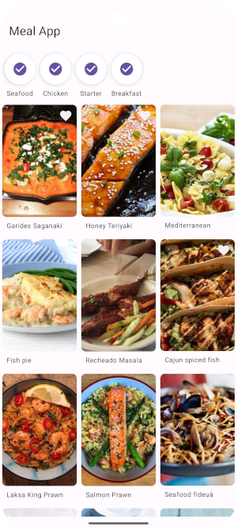
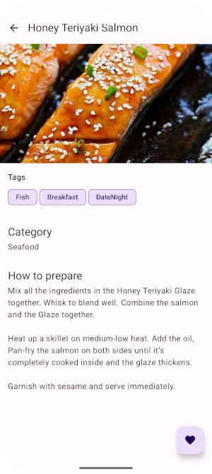
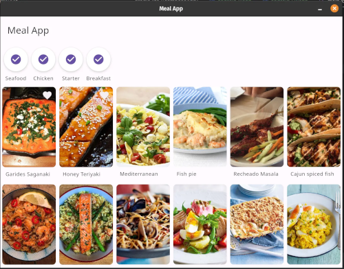

# MealApp - Kotlin Multiplatform Example

**MealApp** is a Kotlin Multiplatform (KMP) application designed to showcase modern development practices across Android, iOS, and Desktop platforms. The project demonstrates how to leverage shared code for mobile and desktop development while preserving platform-specific functionalities where necessary.

### App Screenshots


<div style="display: flex; gap: 10px; justify-content: center;">

  
  

</div>

### Desktop Screenshot




### Features

- Supports Android, iOS, and Desktop platforms.
- Compose multiplatform for UI 🚀 ❤️
- Implements core functionalities for managing meals: browsing meals by category, viewing detailed information, and marking favorites.
- Integrates local and remote data sources using modern libraries and patterns.
- **Test for use cases and repository**

### Code Structure

This Kotlin Multiplatform project is organized as follows:

- **`/composeApp`**: Contains shared code for Compose Multiplatform applications. This includes:
    - `commonMain`: Shared logic and code for all platforms.
    - Platform-specific folders (e.g., `iosMain`, `androidMain`, `desktopMain`): Code specific to the target platform.
- **`/iosApp`**: Entry point for the iOS application. This is where Swift or SwiftUI code may be added
  - > **Note:** Due to technical difficulties with my mac, the iOS version has not been tested on a macOS device. However, the implementation has been planned and follows standard practices for Kotlin Multiplatform, so it should work.
- **`/desktopApp`**: Entry point for the Desktop application using Compose for Desktop.

### Technologies Used

- **Kotlin Multiplatform** for shared code.
- **Jetpack Compose Multiplatform** for UI on Android, iOS, and Desktop.
- **Ktor** for networking.
- **Room** for local persistence on Android.
- **Core Data** for local persistence on iOS.
- **Koin** for dependency injection.
- **Flow and StateFlow** for reactive programming.

### Running the Project

To run the project, follow these steps:

0. Just avoid until step 3 if you don't want to provide your own API_KEY, it should work
1. Obtain an API key from [TheMealDb](https://www.themealdb.com/api.php).
2. Add the API key to the `local.properties` file in the root directory:

    ```properties
    API_KEY=your_api_key_here
    ```

3. Run the application on your desired platform:
    - **Android:** Use Android Studio or the command `./gradlew installDebug`.
    - **iOS:** Use Xcode to run the `iosApp`.
    - **Desktop:** Use the command `./gradlew :desktopApp:run`.

---
